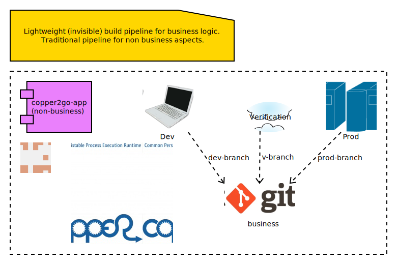

# copper2go

Implementation of a lightweight CI/CD pipeline using git repositories for changes in COPPER workflows.

One of the basic ideas of COPPER is to be able to perform software changes in business workflows at runtime. With
release 5.1 this now can be done by using git repositories.

copper2go makes use of this feature and should help to use COPPER in your project. All you need to do is, to start the
copper2go container with your configuration, that support your business workflow.

As one of the future steps, there might follow a factoryfx integration. This will enable copper2go to make runtime
changes in the technical part of the application outside the business workflows without usage of the traditional
pipeline.

This picture shows a first overview:

## Quick Start

In your container you can run workflows that are accessible via git. Just start with the ones
in  https://github.com/Keymaster65/copper2go-workflows.

* Start container
    * `docker run -d -p 59665:59665 -d --pull always --name copper2go --rm registry.hub.docker.com/keymaster65/copper2go:4.2.0`
* In Browser you can see the used licenses
    * `http://localhost:59665/`
    * `http://localhost:59665/copper2go/3/api/twoway/2.0/Hello` will deliver a "IllegalArgumentException: A name must be
      specified."
* Use any other HTTP-Client and POST your name to the URL
    * Example: `curl --data Wolf http://localhost:59665/copper2go/3/api/twoway/2.0/Hello`
        * Will produce someting like `Hello Wolf! Please transfer 4 cent`

### Change Workflows

You want to develop your own workflows? You may start with the existing ones.

* Clone or fork the copper2go-workflows **gradle** project: https://github.com/Keymaster65/copper2go-workflows
* Modify configuration and store it into environment variable C2G_CONFIG.
    * Start with
      file: https://github.com/Keymaster65/copper2go/blob/release/4/src/main/resources/io/github/keymaster65/copper2go/application/config/config.json
        * store it in your local docker host `config.json`
        * Typically, modify workflowGitURI location
* Start Container with your configuration:
    * `docker run -p 59665:59665 -e C2G_CONFIG="$(cat config.json)" -d --pull always --name copper2go --rm registry.hub.docker.com/keymaster65/copper2go:4.2.0`

## More Motivation

COPPER was developed as an Orchestration Engine. For more than 10 years now, in 2021, many high performance systems are
in production. The online configuration capability of this workflow engine is used seldom. To fill this gap, by using
this feature as a main concept, copper2go was developed. By adding connectors, the development of Orchestration Services
will become easier for Java developers.

You can see copper2go as a "Plattform as a Service", if you want to enable your clients to write and support their own
COPPER workflows.

With an existing git repository, that contains all COPPER workflows of your orchestration services, copper2go is the
enabler for "Software as a Service" orchestration systems.

Of course, copper2go containers can be run wherever you want. So the container may run

* Internet Workflows, if hosted in the web
* Intranet Workflows, if hosted in a company
* Desktop Workflows, if run on your system

In times of automated build pipelines the needs for workflow systems are reduced, but a more lightweight **git** based
pipeline might even better fit your needs. Here are some more advantages:

* If the developers want to break the limits, they can use the vanilla-engines as forks on github
* Using git and git workflows in the development teams
* Additional quality steps can be integrated into the git workflow
* Lightweight pipeline form source code to deployment, because build is inside the copper2go container
* Reuse of copper2go images might reduce costs for images in the cloud
* Unified copper2go images
* Secure copper2go images
* Easy extensions of copper2go images as forks on github
* Easy extensions of copper2go connectors as forks on github

## Vulnerability

The copper2go application is checked using the https://plugins.gradle.org/plugin/org.owasp.dependencycheck, so engine do
not contain any open known security issue. As workflows can not extend the used jars this check is sufficient for all
workflow use cases.

## Developer's Guide

copper2go bases on the COPPER (COmmon Persistable Process Excecution Runtime). To get more information about COPPER, you
might visit https://github.com/copper-engine or https://github.com/copper-engine.

### Online Configuration

Using git only, and compiling the workflow inside the container, you can very easy change your system's behaviour
"online". That is what want many people dream of, if they talk about "configuration". As one use case you can simply
"revert" your changes, if something goes wrong. As the container is separated from the workflow, this "revert"
always works by concept.

### Reactive Applications

Non-blocking threads is one of the core concept of COPPER. That is the reason, why you can develop reactive high
performance applications using COPPER or copper2go. A good motivation can be found in the "reactor" reference
https://projectreactor.io/docs/core/release/reference/#intro-reactive

### Non-Blocking Threads but easy to Maintain

In spite of the non-blocking code with callback inside COPPER, the COPPER workflow Java code is readable and looks as
simple as blocking code. There is no "callback hell" in your project. You might have a look at the "Motivation" of the
Loom Project in
https://cr.openjdk.java.net/~rpressler/loom/Loom-Proposal.html.

### Long Running Workflows

Last but not least, COPPER workflows can be executed for an unlimited time. It depends on the resources you add to the
application. Transient workflows are supported in copper2go since release 0.1. Persistent workflows are supported by
COPPER and currently in the Backlog of copper2go.

### COPPER Details

COPPER workflows look like Synchronous Java Code. This code is instrumented at compile time on the server. If you want
to become more familiar with COPPER, that you might visit

* https://copper-engine.org/docs/content/copper.pptx
* https://copper-engine.org/docs/content/COPPER-best-practices_1.0.1-en.pdf
* https://copper-engine.org/docs/content/COPPER-WorkflowCompatibilityRules-1.2.0-en.pdf
* https://copper-engine.org/docs/unsorted/
* https://github.com/copper-engine
* https://copper-engine.org/

### copper2go Details

The API described below is not much to read. I would suggest using the "Quick Start" and then start to develop a little
sample application.

You came to a point, where you are missing a feature? No Problem. You might ues a pull request, if you want to add it by
yourself. Of cource you can fork on GitHub. You may also add an item in
https://github.com/Keymaster65/copper2go/issues

I am looking for feedback.

#### copper2go Architecture

The Architecture overview

shows the main packages, classes and infaces of copper2go. Beside the workflows and the workflow api, you should be
aware of the connector capabilities.

#### Connector Capabilities

TO DO

#### More Samples

https://github.com/Keymaster65/copper2go-tools-bridge

#### Versioning and API

##### Workflow API

The copper2go Workflow's API is hosted in the Maven Central. It can be found at several places

* https://mvnrepository.com/artifact/io.github.keymaster65/copper2go-api
* https://search.maven.org/search?q=copper2go
* https://repo1.maven.org/maven2/io/github/keymaster65/copper2go-api/

Starting with Workflow API 3.1.0 it also contains some dependencies, that extend the API.

Changes will be listed here in the "Released" chapter. In addition, you have the API to the COPPER framework.

Last but not least, the Java 17 API can be used and is contained in the copper2go container.

##### Workflow's API Detail

Visit the sources, tests, examples and JavaDocs:

| API       | Link to JavaDoc                                                                                       |
|-----------|-------------------------------------------------------------------------------------------------------|
| core      | [copper2go-api](https://www.javadoc.io/doc/io.github.keymaster65/copper2go-api/latest/index.html)     |
| extension | [copper-coreengine](https://www.javadoc.io/doc/org.copper-engine/copper-coreengine/latest/index.html) |
| extension | [slf4j-api](https://www.javadoc.io/doc/org.slf4j/slf4j-api/latest/org.slf4j/module-summary.html)      |
| JDK       | [Java 17 API](https://docs.oracle.com/en/java/javase/17/docs/api/index.html)                          |

##### Application API

The configuration of the application and the receiver's APIs will be listed here as Application API in the
"Released" chapter.

No Java code except of Workflow's API is released as an API. Of course, you can fork the project, if you want to make
extensions.

The releases are hosted at github:
https://github.com/Keymaster65/copper2go/releases

Docker images can be found here: https://hub.docker.com/r/keymaster65/copper2go

###### Application Configuration

###### Main Configuration

https://github.com/Keymaster65/copper2go/blob/release/4/src/main/resources/io/github/keymaster65/copper2go/application/config/configSystemTestComplete.json

you find examples for the configuration of

* COPPER Workflows (workflowRepositoryConfig)
* HTTP Receiver (Server) (httpPort)
* HTTP Request/Response (httpRequestChannelConfigs)
* Kafka Server (kafkaHost, kafkaPort)
* Kafka Receiver (kafkaReceiverConfigs)
* Kafka Request/Response (kafkaRequestChannelConfigs)

###### Logging Configuration

The logback logging is defined in
https://github.com/Keymaster65/copper2go/blob/release/4/src/main/resources/logback.xml

There you can find the environment variables, that can be used to control logging at container start.

###### HTTP Receiver API

URLs path should be "/copper2go/3/api/TYPE/MAJOR.MINOR/WORKFLOW-NAME

where

* The '3' relates to the HTTP Receiver API major version
* The '2' Application API major version is still supported but DEPRECATED
* TYPE can be
    * "twoway" if a body is expected in the reply. The HTTP reply is submitted during workflow processing.
    * "oneway if, no body is expected in the reply. The HTTP reply is submitted when workflow is initiated
* MAJOR.MINOR is the version of the workflow
* WORKFLOW-NAME is the target workflow of the request

URL "/" shows licence information.

###### Kafka Receiver API

TODO

###### StandardInOut Receiver API

TODO

### Missing Features?

If you want to add something, you may contribute with pull requests or forks. In a fork you might add 3rd party libs as
wished.

Forks or Pull Requests are always very welcome.

Issues are very welcome, too.

### Releasing and Maintenance

* The master branch is maintained and released as "latest" image.
* The newest version branch is maintained and released as a tagged image for example "4.2.0"
* The newest Workflow API is maintained

#### Release Tasks
1) Optional: `gradle dependencyUpdates`
1) Optional: `gradle dependencies :sync-application:dependencies :vanilla-application:dependencies :application-framework:dependencies :copper2go-app:dependencies :scotty-engine:dependencies :sync-engine:dependencies :vanilla-engine:dependencies  :copper2go-api:dependencies :connector-standardio:dependencies :connector-kafka-vertx:dependencies :connector-http-vertx:dependencies :connector-api:dependencies  :engine-api:dependencies --write-locks`
1) Optional: `gradle dependencies :sync-application:dependencies :vanilla-application:dependencies :application-framework:dependencies :copper2go-app:dependencies :scotty-engine:dependencies :sync-engine:dependencies :vanilla-engine:dependencies  :copper2go-api:dependencies :connector-standardio:dependencies :connector-kafka-vertx:dependencies :connector-http-vertx:dependencies :connector-api:dependencies  :engine-api:dependencies --write-locks --refresh-dependencies`
1) `gradle dependencyCheckAggregate`
1) `gradle clean build`
1) `gradle clean integrationTest`
1) `gradle :copper2go-application:build :copper2go-application:jib`
1) `gradle systemTest`
1) Optional: `gradle :vanilla-application:build :vanilla-application:jib`
1) Optional: `gradle :sync-application:build :sync-application:jib`

#### master

1) Release Tasks
1) push master

#### newest version branch

1) release master
1) checkout version branch
1) merge master to version branch
1) update version for jib (in copper2go-appliction/build.gradle.kts)
1) execute "Release Tasks"
1) push version branch
1) "Draft a new release on github" on version branch (look at older releases for details)
1) Update README version in master and push
1) Merge master to version branch

### Links

* https://repo1.maven.org/maven2/io/github/keymaster65/copper2go-api/
* https://hub.docker.com/r/keymaster65/copper2go
* https://github.com/Keymaster65/copper2go/releases
* https://github.com/copper-engine
* https://copper-engine.org/
* https://copper-engine.org/blog/2019-12-09-/copper-5.1-released/
* https://github.com/factoryfx

## Ongoing

Of course, copper2go is ready use. Many more capabilities might be added. Here you find some of them ;-)

### "Loom" Release Application API 4.3

* [x] Add pitest support (https://pitest.org/)
* [x] Add a sync-engine and application with blocking code
* [x] Run sync-application on JDK 19
* [x] Security updates
* [x] Additional updates
* [x] Add licenses to sync-application

#### "slf4j-api and jackson-databind" Workflow API 3.2.0

* [x] Update slf4j-api from 2.0.0-alpha5 to 2.0.5
* [x] Update jackson-databind from 13.2.2 to 2.14.1

## Planning

### "Operator" Release Application API 4.4

* [ ] configure thread pool size, client pool size and more
* [ ] Support of COPPER core GUI
* [ ] JMX usage in Container

### "Binding" Release Application API 4.5

* [ ] Workflow with Json binding
* [ ] Workflow with XML binding (may be not ;-)
* [ ] Split copper2go-workflows
* [ ] Add new Workflow Repository for Performancetest

### "State Pattern" Release Application API 4.6

* [ ] Spike: Workflow using State Pattern or other defined strategy in copper2go-engine

### Backlog

* Support native executable for sync-application (may be graal?)
* Remove version 2 of HTTP Receiver API
* Finish support kafka events
* Add new Repository Performancetest
* Replace vertx HTTP components with simpler implementation
* Replace vertx Kafka components with simpler implementation
* STDIN/OUT support in config and container (or remove it)
* Redesign DefaultRequestChannel (like Kafka). Use WARN instead of ERROR?
* Redesign RequestChannel/EventChannel: Is the difference needed? Why 2 errorEvent (was inspired by STDOUR/ERR)?
* Collect Statistics and other (may be useful for Tests like Bridge-Test)
* Add test coverage for workflows to copper2go-workflows
* Release internet workflow application as copper2go-webapp (see branch experiment/webapp)
* Multi workflow support and REST level
* HTTP Security
* Kafka Security
* Add information "How Tos" to developer's guide
      * Overview
      * Request Channel Stores
      * Event Channel Stores
      * Configuration Reply Channel Store
      * Tickets
      * Workflow Development/Test
* Load workflow subtree only from git
* Use vanilla-engine without a github fork
* Extend connectors without a github fork
* Extend copper2go image without a github fork
* Delete .copper on start (if still problems occurs)
* Kafka choreography example
* Support Binary data
* Binary Binding
* JMS support (may be IBM MQ, ActiveMQ or ...)
* PostgreSQL for workflow persistent instances
    * Add callback in WorkflowData ("replychannel")
    * Support of callbacks
* PostgreSQL support for business resources
* Async idempotent DB API
* On demand only: factoryfx integration
* On demand only: extend workflow attributes to a MultiMap
* Withdrawn: Vertx Bus Connector

## Released

### "Vanilla" Release Application API 4.2

* [x] Add license info "vanilla" engine implementation
* [x] Add "vanilla" engine implementation
* [x] Add "vanilla" engine implementation as incubating feature
* [x] Fix CVE-2022-38752 by excluding snakeyaml
* [x] Security updates
* [x] Version updates

### "Service" Release Application API 4.1.1

* [x] Security Updates
* [x] Version Updates

### "3rd Party" Release Workflow API 3.1.0

* [x] Add 3rd party libs to supported Workflow API

### "Log Config" Release Application API 4.1

* [x] Make logLevel accessible via environment
* [x] Add log configuration here and changed defaults

### "Security" Release

#### Application API 4

* [x] Remove vulnerabilities in dependencies
* [x] Upgrade to higher libs, copper2go depends on

### "Kafka/Http Bridge, Quality and Java 17" Release

#### Application API 3.0

* [x] Support for Java 17
* [x] Add Bridge Workflow
* [x] Add quality badges
* [x] Support HTTP URL parameter (in but no out)
* [x] Support Kafka Header (parameter) (in and out)
* [x] Improve unit test coverage up to 95% or more
* [x] Update many used jars
* [x] Add use case in Developer's Guide
* [x] Refactor engine subproject for tests and extracting engine-api and connector-api
* [x] Refactor connector subproject for tests and extracting more modules
* [x] Fix memory leak in ReplyChannelStore
* [x] UUID might not be set in WorkflowData (breaking change)
* [x] Use term "oneway" instead of (incoming) "event" in code (breaking change)
* [x] Use term "oneway" instead of (incoming) "event" in this README

URLs path should be "/copper2go/3/api/TYPE/MAJOR.MINOR/WORKFLOW-NAME

where

* The '3' relates to the Application API major version
* The '2' Application API major version is still supported but DEPRECATED
* TYPE can be
    * "twoway" if a body is expected in the reply. The HTTP reply is submitted during workflow processing.
    * "oneway if, no body is expected in the reply. The HTTP reply is submitted when workflow is initiated
* MAJOR.MINOR is the version of the workflow
* WORKFLOW-NAME is the target workflow of the request

URL "/" shows licence information.

#### Release Workflow API 3.0

* [x] Support HTTP URL parameter (in but no out)
* [x] Support Kafka Header (parameter) (in and out)
* [x] Remove payload member from WorkflowData (breaking change)
* [x] Require Java 17 (breaking change)
* [x] Restructure packages (breaking change)

#### Release Bridge Workflow 1.0

* [x] New Repository for Bridge Workflow
* [x] System tests
* [x] Add use case in Developer's Guide

### "Kafka" Release Application API 2.1

* [x] Kafka Connectors
* [x] Separate System- and Integration- testing in Build Pipeline

### "License" Release Application API 2.0.1

* [x] Add licence info more files and update year
* [x] Add licence URL in non Docker apps
* [x] Add API release info
* [x] Correct URLs in Quick Start
* [x] Replace the lax Application API by a stricter validation

### "Bugfix POM" Release Workflow API 2.0.1

* [x] No source change, but correction in POM file versions

### "Developer" Release Workflow API 2.0 and Application API 2.0

* publish to public artifact repository
* Add How to develop Workflows for IDEA
* Add How to develop Workflows for gradle
* Draft development Guide

#### Workflow API 2.0

Now the API is available in maven. Due to the OSSRH process, the package were refactored.
https://repo1.maven.org/maven2/io/github/keymaster65/copper2go-api/

#### Application API 2.0

URLs path must be "/copper2go/2/api/TYPE/MAJOR.MINOR/WORKFLOW-NAME

where

* The '2' relates to the Application API major version
* TYPE can be
    * "request" if a body is expected in the reply
    * "event" if, no body is expected in the reply
* MAJOR.MINOR is the version of the workflow
* WORKFLOW-NAME is the target workflow of the request

URL "/" shows licence information.

### "HTTP Container" Release Notes Workflow API 1.0 and Application API 1.0

* http server support
* http client support
* non-business config
* Multi workflow
* docker image distribution
* add license info
* Add Application and Workflow path
* Event consuming workflows (no reply body, state 202 only)
* quick start

#### Workflow API 1.0

The payload is now part of the WorkflowData
https://github.com/Keymaster65/copper2go/tree/release/1.0/src/main/java/de/wolfsvl/copper2go/workflowapi

#### Application API 1.0

Support for configuration of the HTTP server and
https://github.com/Keymaster65/copper2go/blob/release/1.0/src/main/resources/de/wolfsvl/copper2go/application/config/config.json

URLs must end with /MAJOR.MINOR/WORKFLOW-NAME

where

* MAJOR.MINOR is the version of the workflow
* WORKFLOW-NAME is the target workflow of the request

### "MVP" Release Notes Workflow API 0.1 and Application API 0.1

* 0.1 A first MVP (Minimum Viable Product)

#### Workflow API 0.1

https://github.com/Keymaster65/copper2go/tree/release/0.1/src/main/java/de/wolfsvl/copper2go/workflowapi

#### Application API 0.1

No configuration support and all payloads are processed by the "Hello" workflow.
